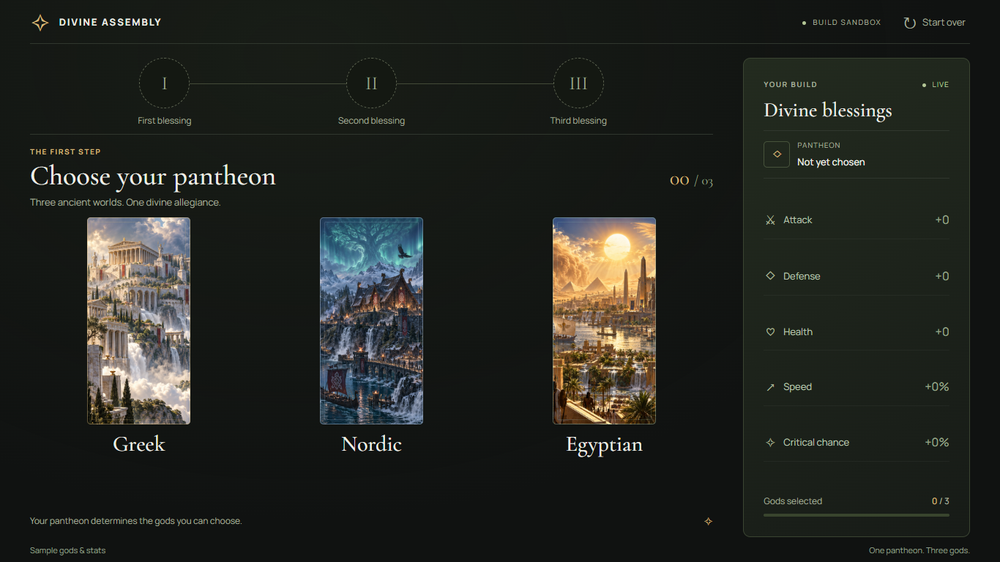

# Divine Assembly

A responsive god-selection sandbox built with plain HTML, CSS, and JavaScript. Choose a pantheon, then one god from each of three rounds to assemble a build.



## Features

- Greek, Nordic, and Egyptian pantheons, with **3 → 3 → 3** god choices.
- Three selection circles; click a filled circle to revise that and later choices.
- God roles, active city abilities with **24-hour cooldowns**, and passive effects for every pantheon.
- Live build summary, ability-details dialogs, back navigation, and reset.
- **1:2 artwork** that keeps its proportions on desktop, tablet, and phone screens.
- Keyboard-accessible controls and dialogs, with reduced-motion support.

Greek, Nordic, and Egyptian content and artwork are configured. Cooldowns describe game rules; this sandbox does not cast abilities or run timers. Refreshing the page resets selections.

## Run locally

Open `index.html` directly in a modern browser, or use **Node.js 22 or newer** (Node 24 is used in CI):

```sh
npm ci
npm start
```

Open **http://127.0.0.1:4173**. There are no third-party npm dependencies, API keys, or environment files to configure. Google Fonts is optional; system fonts are used when it cannot load.

| Command | Purpose |
| --- | --- |
| `npm start` / `npm run dev` | Serve the source files locally; refresh after editing. |
| `npm run check` | Check JavaScript, god data, PNG proportions, and local file references. |
| `npm run build` | Validate, then recreate `dist/` with only public site files. |
| `npm run preview` | Serve the built `dist/` directory. |

Pass `-- --port 8080` to start or preview on another port. To check the same subdirectory layout as a GitHub project site:

```sh
npm run build
npm run preview -- --base=god_selector
```

Then open **http://127.0.0.1:4173/god_selector/**.

## Project structure

```text
index.html          Page structure and ability dialog
styles.css          Theme, responsive layout, and fixed-ratio banners
data.js             Pantheons, god order, roles, abilities, stats, and icons
app.js              Selection state, rendering, and interactions
assets/             Supplied pantheon and god artwork
scripts/            Dependency-free checks, build, and local server
.github/workflows/  Pull-request checks and GitHub Pages deployment
dist/               Generated site; ignored by Git
```

## Update gods and artwork

Edit `PANTHEONS` in `data.js` to change the three rounds and their order. Each round contains three gods. Edit `BLESSINGS` to change a god's role, active ability, or passive effect. Passives are displayed separately because they affect different unit types and situations; temporary active effects are not added to permanent totals.

All active abilities use `ACTIVE_COOLDOWN_HOURS = 24`. Dionysus's passive is **“25% effectivity and duration for festivals.”**

Add artwork to `assets/` and set the corresponding `image` path. Use lowercase filenames with an exact **1:2 width-to-height ratio**, such as **800 × 1600 px**. Keep labels out of the image; the app renders names and roles separately. PNG artwork is checked for the required ratio. Supplied image files are included in the repository.

Run `npm run check` after edits. Keep data and asset paths relative so the app works under a GitHub repository subdirectory. `data.js` must load before `app.js`; both are deferred classic scripts so direct file opening continues to work.

## Publish on GitHub Pages

1. Create an empty GitHub repository and push this project's `main` branch. If using GitHub Desktop, add this local repository and choose **Publish repository**. With Git CLI, make the initial commit, add your repository's URL as `origin`, then run `git push -u origin main`.
2. In the GitHub repository, open **Settings → Pages → Build and deployment**, then choose **GitHub Actions** as the source.
3. Open **Actions → Deploy GitHub Pages → Run workflow**. Later pushes to `main` deploy automatically.
4. Open the deployment URL shown in the workflow's `github-pages` environment.

The Pages workflow checks the project, builds `dist/`, and publishes only that directory. It uses GitHub's built-in workflow token; no personal token is needed. Pull requests run validation without deploying.

See [GitHub's custom Pages workflow guide](https://docs.github.com/en/pages/getting-started-with-github-pages/using-custom-workflows-with-github-pages) for hosting setup. GitHub Pages availability depends on the repository visibility and account plan.
